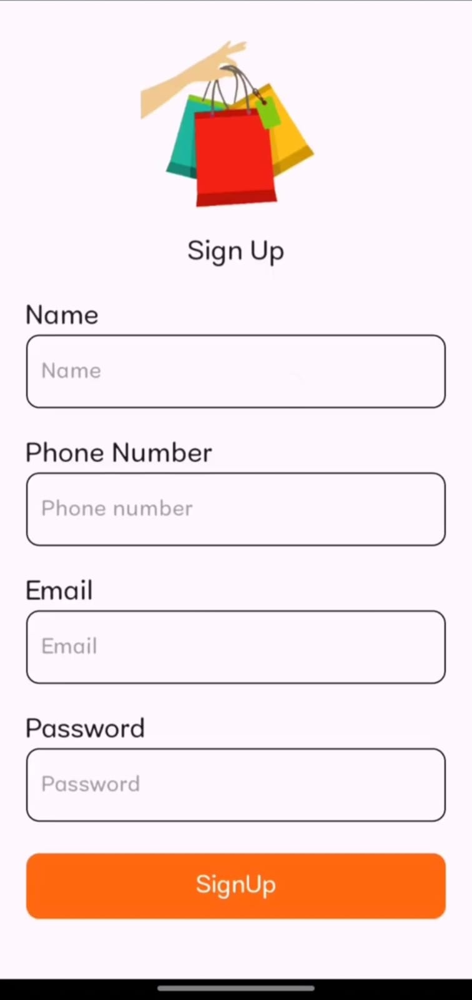
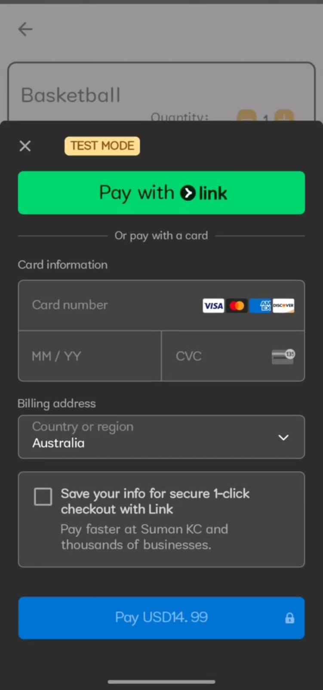
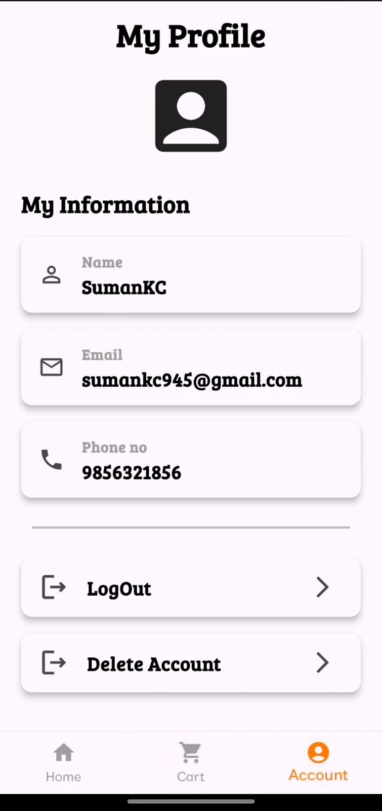

# 🛍️ E-Commerce App

A complete Flutter E-Commerce application built with Firebase backend.  
This project demonstrates product catalog browsing, cart management, user authentication, search functionality, checkout flow, and payment integration.  

## 🚀 Features
- **User Authentication** (Login & Signup with Firebase)
- **Product Catalog** with detailed product pages
- **Search Functionality**
- **Cart Management**
- **Checkout & Payment Integration**
- **User Profile Management**
- **Responsive UI** for different screen sizes
- **State Management** with Provider

## 📸 Screenshots

| Landing | Login | Signup |
|---------|-------|--------|
|  |  |  |

| Home Screen | Product Detail | Cart |
|-------------|----------------|------|
|  |  |  |

| Checkout | Payment | Search | Profile |
|----------|---------|--------|---------|
|  |  |  |  |

## 📱 App Flow
1. **Landing Page** → User is welcomed with an intro/branding screen.  
2. **Login / Signup** → Secure authentication using Firebase.  
3. **Home Screen** → Browse product listings.  
4. **Product Detail** → View detailed information about each product.  
5. **Search** → Quickly search for specific items.  
6. **Cart** → Add/remove products, view total price.  
7. **Checkout** → Proceed to checkout with order summary.  
8. **Payment** → Complete payment securely.  
9. **Profile** → Manage user account and preferences.  

## 🛠️ Tech Stack
- **Framework**: Flutter (Dart)  
- **Backend**: Firebase  
- **State Management**: Provider  
- **Database**: Firestore  
- **Authentication**: Firebase Auth  
- **Payments**: Firebase / Custom Integration  

---

📌 This project demonstrates my ability to build end-to-end, production-ready mobile applications with modern Flutter development practices.
